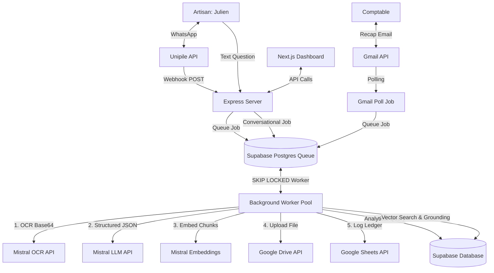
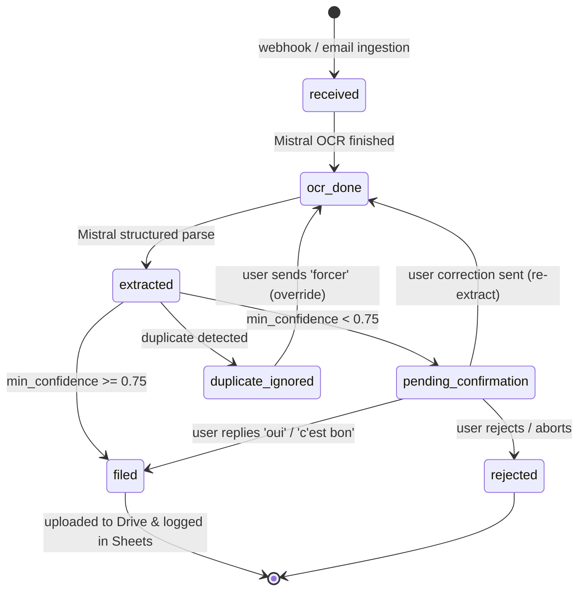

# Klerk — Architecture & System Design

This document details the architectural choices, system state machine, RAG implementation, and safety guarantees for Klerk.

---

## 1. Component Diagram

The following Mermaid diagram shows the components, data flows, and integrations:

---

## 2. Document State Machine

A document's progression through Klerk is managed by a strict state machine:

### State Transitions & Triggers
1. **`received`**: Triggered when a new webhook payload (WhatsApp) is received or a candidate email is pulled from Gmail. The file binary metadata is recorded and the job is queued.
2. **`ocr_done`**: Triggered when the background worker successfully calls `mistral-ocr` and saves the raw markdown representation.
3. **`extracted`**: Triggered when `mistral-large` parses the markdown text and returns metadata (amounts in cents, supplier name, invoice date, due date).
4. **`pending_confirmation`**: Triggered if any critical field (`supplier_name`, `total_ttc`, `doc_date`, `due_date`) has confidence `< 0.75`. The system asks the artisan for verification via WhatsApp.
5. **`duplicate_ignored`**: Triggered when a document has an identical file hash or metadata matching an already filed invoice.
6. **`filed`**: Triggered when the file is successfully uploaded to Google Drive in the folder `Compta/YYYY/MM-Month/Category` and appended to the Google Sheets Ledger.

---

## 3. RAG & Three-Way Router Design (Flow E)

Conversational text queries from the artisan are parsed by a **three-way semantic router** implemented with the Mistral Chat API:

1. **ANALYTIC Path**: Aggregates structured data. The LLM selects a predefined query tool (`getSupplierTotalExpenses`, `getInvoicesDueInRange`, `getTotalExpensesForPeriod`, `getChantierExpenses`) and fills its parameters.
2. **CONTENT Path**: Queries specific textual document contents (e.g. warranty terms). A query embedding is generated, metadata filters are compiled, and a vector similarity search is performed over the `document_chunks` table. The matched blocks and file Drive links are sent to Mistral to construct a grounded response.
3. **HYBRID Path**: Handles composite queries (e.g., total expenses for a specific chantier). The system uses vector search to identify documents linked to the chantier, fetches their metadata, filters out non-expense documents (like quotes), and performs arithmetic summation in code.

### RAG Chunking Strategy
Document OCR output is chunked in a structure-aware manner:
- **Line Items block**: Grouped together into a single structured text block so unit prices and descriptions are not separated.
- **Totals block**: Extracted as a single chunk containing HT, TVA, TTC, and tax rates.
- **General text paragraphs**: Split by Markdown paragraph breaks and filtered to keep only chunks longer than 30 characters.
This preserves table alignments and ensures the vector search retrieves contiguous clauses.

---

## 4. Engineering Tradeoffs & Safety Decisions

### NFR-1: Idempotency Webhook Protection
All webhooks (Unipile or Gmail API events) carry unique provider message IDs (for WhatsApp: `message_id`, for Gmail: `message_id:attachment_id`). We enforce a `UNIQUE` index on the database `provider_message_id`. Any duplicate webhook replay fails the insert step, returning `200 OK` safely without re-triggering jobs or duplication.

### NFR-2: Queue and Rate-limit Resilience (Mistral 429s)
Instead of using a full-blown queue service (which may fail on transactional database poolers), we implemented a **SKIP LOCKED Postgres Queue** model. 
All Mistral API client requests are wrapped inside a retry handler featuring:
- **Exponential Backoff**: Delay starts at 1 second and doubles with each attempt.
- **Random Jitter**: Add `0-1000ms` random noise to prevent synchronized thundering herd retries.
- **Bounded Concurrency**: The worker pool processes jobs sequentially or with limited concurrency, absorbing rate limits smoothly.

### NFR-3: SQL Injection Protection (Analytic safety)
The LLM **never** generates raw SQL. It acts strictly as an entity parser selecting a pre-defined tool. The backend executes parameterized queries (e.g., `WHERE supplier_name = $1`) against the PostgreSQL database. This completely neutralizes SQL injection risks.

### NFR-7: Money Safety
Floating-point numbers (IEEE-754) are banned from financial calculations. All HT, TVA, and TTC amounts are parsed, processed, and stored as **integer cents**. Currency formatting (`1 246,80 €`) is applied only at the presentation layer (Google Sheets display and Dashboard UI).

---

## 5. Decisions & Open Assumptions

- **Single Artisan Focus**: Multi-tenancy is out of scope. The database and webhooks assume one connected artisan WhatsApp number and one Gmail inbox.
- **French formatting**: Invoices are parsed in French. Dates (e.g. "12 juin 2026") are parsed by Mistral and formatted as `YYYY-MM-DD`.
- **Payment tracking**: "Overdue" status is calculated strictly relative to the invoice `due_date` compared to the current date; banking reconciliations are excluded.
